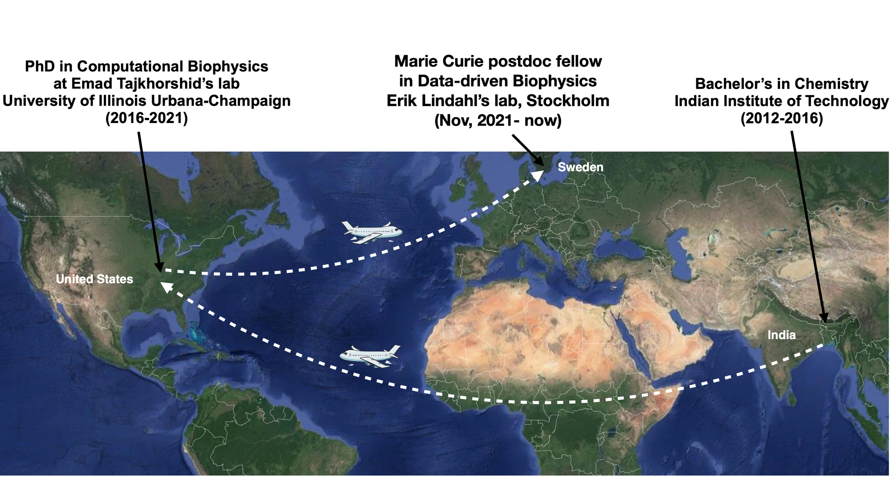

Three countries, one thread running through them: understanding biomolecules through simulation.

- **India (2012–2016)** — Bachelor's in Chemistry, Indian Institute of Technology.
- **United States (2016–2021)** — PhD in Computational Biophysics, Emad Tajkhorshid's lab, University of Illinois Urbana-Champaign.
- **Sweden (Nov 2021–now)** — Marie Curie Postdoctoral Fellow in Data-driven Biophysics, Erik Lindahl's lab, Stockholm.
